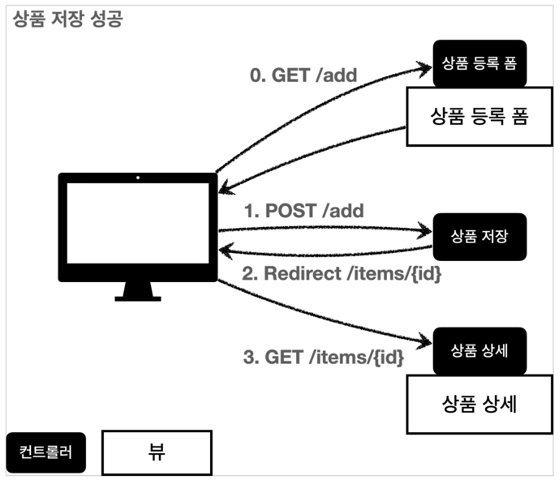
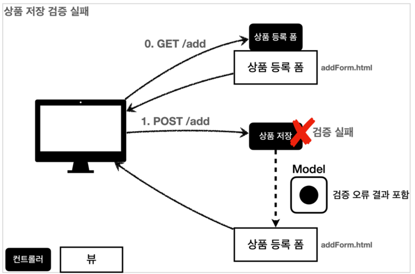

# validation
## MVC 2편 (김영한)
**목표: 스프링과 타임리프가 제공하는 검증 기능을 활용해보자.**

## 검증1 -Validation

**컨트롤러의 중요한 역할중 하나는 `HTTP 요청`이 정상인지 검증**하는 것!

그리고 정상 로직 보다 이런 검증로직을 잘 개발하는것이 더 중요 할 수도 있다.!!

### 클라이언트 검증 VS 서버 검증
* 클라이언트 검증은 조작할 수 있으므로 보안에 취약
* 서버만으로 검증하면, 즉각적인 고객 사용성 부족
* 둘을 적절히 섞어서 사용하되, 최종적으로 서버 검증은 필수
* API 방식을 사용하면 API 스펙을 잘 정의해서 검증 오류를 API 응답 결과에 잘 남겨줘야 한다.

### 검증 요구사항
* 타입 검증
  * 가격, 수량에 문자가 들어가면 검증 오류 처리
* 필드 검증
  * 상품명: 필수, 공백 X
  * 가격: 1,000원 이상, 1백만원 이하
  * 수량: 최대 9,999개
* 특정 필드의 범위를 넘어서는 검증
  * 가격 * 수량의 합은 10,000원 이상

### 상품 저장 성공

### 상품 저장 실패

<br><br>

검증 처리를 하기 위해서는 `@ModelAttribute` 바로 뒤에 `RedirectAttributes`가 와야 한다.
```java
@PostMapping("/add")
public String addItem(@ModelAttribute Item item, RedirectAttributes redirectAttributes, Model model) {

        //검증 오류 결과 보관
        Map<String, String> errors = new HashMap<>();

        //검증 로직
        if(!StringUtils.hasText(item.getItemName())) {
        errors.put("itemName", "상품 이름은 필수 입니다.");
        }
        if(item.getPrice() == null || item.getPrice() < 1000 || item.getPrice() > 1000000) {
        errors.put("price", "가격은 1,000 ~ 1,000,000 까지 허용합니다.");
        }
        if(item.getQuantity() == null || item.getQuantity()>= 9999) {
        errors.put("quantity", "상품 수량은 최대 9,999 까지 허용 합니다.");
        }

        //특정 필드가 아닌 복합 룰 검증
        if(item.getQuantity() != null && item.getPrice() != null) {
        int resultPrice = item.getPrice() * item.getQuantity();
        if (resultPrice < 10000) {
        errors.put("globalError", "가격 * 수량의 합은  10,000원 이상을 허용합니다. 현재 값 = "+resultPrice);
        }
        }

        //검증에 실패하면 다시 입력 폼으로
        if(!errors.isEmpty()) {
        log.info("errors = {}", errors);
        model.addAttribute("errors", errors);
        return "/validation/v1/addForm";
        }

        //성공 로직

        Item savedItem = itemRepository.save(item);
        redirectAttributes.addAttribute("itemId", savedItem.getId());
        redirectAttributes.addAttribute("status", true);
        return "redirect:/validation/v1/items/{itemId}";
        }
```
**검증오류 보관**

`Map<String, String> errors = new HashMap<>();`

검증시 오류가 발생하면 어떤 검증에서 오류가 발생했는지 정보를 담아둔다...!
## 검증2 -Validation
